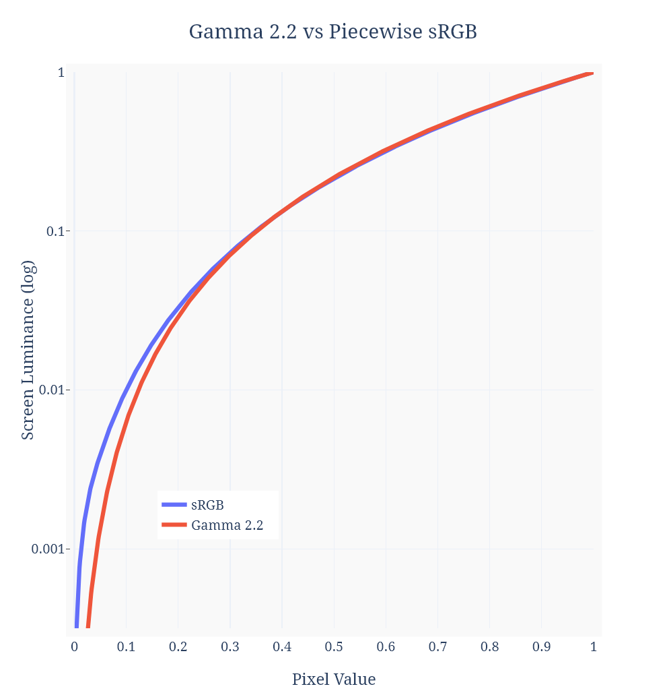
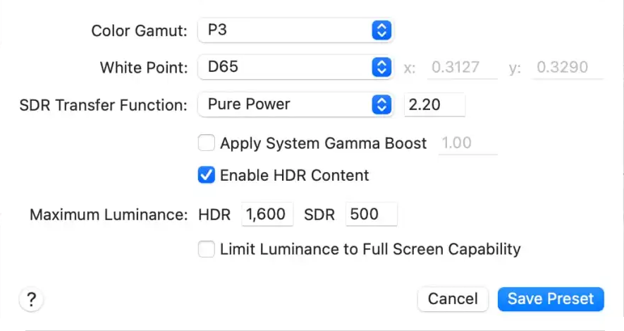

# Transform Windows 11's virtual SDR-in-HDR curve from piecewise sRGB to Gamma 2.2

## <a href='#icm-dl'>Jump to downloads</a>

Windows 11 has made strides in streamlining the HDR experience, finally allowing for casual workstations where HDR is always enabled throughout the desktop. This is made possible by emulating an SDR color space within the native HDR10 composition space so that both types of content can coexist.

However, the specifications for "SDR" can sometimes be ambiguous since there are multiple standards that depend on viewing parameters.

The rule of thumb is:

- Gamma 2.4 — _Rec.709 reference. Dark room viewing (5 lux). Home theater use._
- Gamma 2.2 — _Pseudo-standard in uncontrolled lighting (>50 lux). Computer use._

As of version 22H2, Windows 11 does not allow us to pick which tone curve to use for SDR — in fact it uses _neither_ of the above. Instead, Windows 11 uses what's called the _piecewise sRGB transfer function_, originally intended for computer/web use. This curve is technically the tone response that gamma 2.2 approximates, but for various reasons it wasn't commonly used as an actual display EOTF. Gamma 2.2 took over as the pseudo-standard, and almost every computer monitor still uses it to this day.

Because it's so prolific, almost all web content and computer games are color graded using a gamma-2.2 outputting monitor, intentionally or not. For Microsoft to decide using piecewise sRGB as the virtual SDR curve was a mistake; it forcibly renders almost all apps and web content to look incorrect, some more than others.

As an example, we can take a look at Diablo IV, a game that is meant to be dark and gritty.

|  |
| ---------------------------------------------------- |
| _Diablo IV in HDR (sRGB tone curve)_                 |

|  |
| ------------------------------------------------------------- |
| _Diablo IV in SDR (gamma 2.2 tone curve)_                     |

Diablo IV looks absolutely spectacular in SDR, with deep shadow detail and excellent use of dithering to prevent blacks from appearing blotchy.

On the other hand, there have been countless complaints about the game looking washed out when HDR is enabled, swaying many players to simply enjoy the game in SDR. When HDR is enabled, rich blacks turn into dull grays, and the game's atmosphere turns hazy, losing much of its depth. The primary cause of this is — _you guessed it_ — the piecewise sRGB tone curve that Windows uses in HDR.

We can plot the output luminance of sRGB vs. gamma 2.2 to see the concrete differences:

|                                                                                    |
| ----------------------------------------------------------------------------------------------------------------------------------------- |
| _Gamma 2.2 vs Piecewise sRGB chart. The luminance axis is in log space since our eyes perceive the sensation of lightness logarithmically_ |

s
Here, the discrepancy between gamma 2.2 and sRGB is obvious. The sRGB curve is fundamentally much lighter below the mid-tones, making content mastered in gamma-2.2 appear flat when viewed with an sRGB transfer.

macOS currently offers a nice solution, allowing its users to create their own custom reference mode in the display settings. Among a few others, one of the custom parameters is the _SDR Transfer Function_, which the user can pick between BT.1886 (for film), a pure gamma (2.2, for PC use), or piecewise sRGB (for treason).

|                                |
| ----------------------------------------------------------------------------- |
| _macOS custom reference mode allows the SDR Transfer Function to be adjusted_ |

# Temporary solution

This is a problem that ultimately requires Microsoft to rectify fully, so in the meantime we'll need to resort to a band-aid fix. By using an MHC2 ICC profile, we can apply a system gamma ramp that transforms the SDR sRGB curve into a 2.2 gamma curve.

The caveat with this solution is that _all_ content takes on the same transformation, including native HDR10 implementations, which don't need it; such content will see slightly darker shadows, potentially crushing shadow detail. You can either disable the color profile when viewing native HDR content, or just live with the slight boost in contrast for the sake of convenience.

An accurate curve mapping does depend on Window's _SDR content brightness_ value, so I've provided several profiles to choose from — pick the one closest to your setting. The transformation is also an _ideal_ mapping, so its accuracy will also depend on your monitor and its calibration quality.

<h2 id='icm-dl'>Download srgb_to_gamma2p2 color profile</h2>

- [100 nits / Brightness 5](https://github.com/dylanraga/win11hdr-srgb-to-gamma2.2-icm/raw/main/srgb_to_gamma2p2_100_mhc2.icm)
- [200 nits / Brightness 30](https://github.com/dylanraga/win11hdr-srgb-to-gamma2.2-icm/raw/main/srgb_to_gamma2p2_200_mhc2.icm)
- [300 nits / Brightness 55](https://github.com/dylanraga/win11hdr-srgb-to-gamma2.2-icm/raw/main/srgb_to_gamma2p2_300_mhc2.icm)
- [400 nits / Brightness 80](https://github.com/dylanraga/win11hdr-srgb-to-gamma2.2-icm/raw/main/srgb_to_gamma2p2_400_mhc2.icm)
- [Unspecified](https://github.com/dylanraga/win11hdr-srgb-to-gamma2.2-icm/raw/main/srgb_to_gamma2p2_unspecified.icm)

## Instructions

1. Download one of the color profiles above
2. Open Windows' "Color Management" utility
3. Press "Add" on the bottom left
4. Press "Browse..." and select the color profile you downloaded
5. Enable the "Add as HDR Profile" checkbox (sometimes called "Advanced color")
6. Press "OK"
7. Select the color profile you added and press "Set as Default Profile"
8. Done

<h2 id='alt-sln'>Alternate procedure / custom profile</h2>

Rather than applying an MHC2 color profile, we can use ArgyllCMS' `dispwin` utility to load the transformation instead. The benefit of this is that we can generate and apply any arbitrary LUT independent of color profile. This lets you create transformations with your desired SDR white level and gamma power, and we can instead rely on the profile created by Windows HDR Calibration tool for proper HDR metadata signaling.

1. Download the [release .zip](https://github.com/dylanraga/win11hdr-srgb-to-gamma2.2-icm/releases) from this repo and unzip the contents to a folder where it will permanently reside.
2. Generate a LUT file [from my web tool](https://dylanraga.github.io/gen-srgb-to-gamma-lut/).
3. Open `lut.cal` from step 1 and paste in the contents of LUT generated in step 2, completely replacing the original contents of the file.
   - By default, the file contains the LUT for converting from a white level of 200 and a gamma power of 2.2.
4. Run `srgb-to-gamma.bat` to apply the transformation.
   - Run `revert.bat` to undo the transformation.
5. Run `auto-start.bat` as administrator to apply the transformation on boot.
   - It is not necessary to re-run this when changing the .cal file, but is required if the folder is relocated.

In recent builds of Windows 11, the gamma transformation can be undone when resuming from certain standby conditions. As an additional step, we can create an automated task that re-applies the transformation.

(Optional) To re-apply the transformation on resume from sleep / screen-saver:
   - Open Windows Task Schedular (Win+R, `taskschd.msc`), and doube click the task name "Apply sRGB to Gamma LUT"
   - In the "Triggers" tab, press "New..." to add a new trigger:
   - Set "Begin the task" to "On an event"
   - Set "Log" to "System"
   - Set "Source" to "Power-Troubleshooter"
   - Set "Event ID" to "1"
   - Press "OK" to create the trigger, and "OK" again to finish changing the task.
  

An AutoHotkey script has also been created by [@mspeedo](https://github.com/mspeedo) to apply transformations with varying SDR white levels and gamma powers on the fly. This also adds a key bind to toggle the transformation, which is helpful when viewing native HDR content. You can take a look at it [here](https://github.com/dylanraga/win11hdr-srgb-to-gamma2.2-icm/issues/7).

<h1>Appendix</h1>

## Windows SDR content brightness table

| SDR brightness value | SDR white screen luminance |
| -------------------- | -------------------------- |
| 0                    | 80 nits                    |
| 5                    | 100 nits                   |
| 10                   | 120 nits                   |
| 30                   | 200 nits                   |
| 55                   | 300 nits                   |
| 80                   | 400 nits                   |
| 100                  | 480 nits                   |

## Notes

- The gamma ramp correction will persist when toggling HDR (including via the keyboard shortcut), making SDR appear darker. When disabling HDR, make sure to re-apply your SDR color profile in the Color Management utility ("Set as Default Profile"). Likewise, when re-enabling HDR, make sure to re-apply the corrective color profile. If you don't have an SDR color profile, press "Add" and select _sRGB IEC61966-2.1_ as your default profile.
- If you have an NVIDIA GPU, make sure the NVCP desktop color settings is set to "Accurate" or "Enhanced" mode; the correction will not apply in "Reference" mode.
- All profiles are tagged with a peak luminance of 800 nits and a black level of 0
- Pixel values above diffuse SDR white are untouched; a soft shoulder was added toward unity to blend the curve mapping with HDR values
- Tested on an LG C2 OLED

<small><em>These color profiles were created with the help of [MHC2Gen](https://github.com/dantmnf/MHC2/tree/master/MHC2Gen) and [ArgyllCMS](https://www.argyllcms.com/).</em></small>
